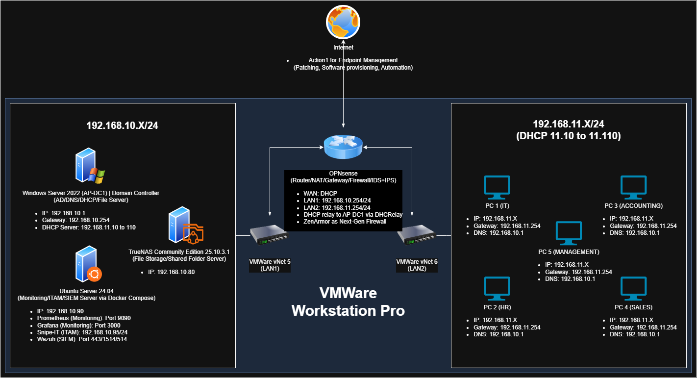

## Project Overview
I built a fully functional corporate network from scratch inside VMware to simulate a 10-employee business. The project demonstrates how to set up network isolation, central identity management, secure network storage, endpoint management, and centralized security monitoring (SIEM).
 
## Network Diagram

*Figure 1: The finalized network layout of the lab showing the two subnets and traffic flow.*
 
---
 
## The Tech Stack
* **Virtualization:** VMware Workstation Pro (VMnet5 & VMnet6)
* **Firewall/Router:** OPNsense
* **Domain Controller:** Windows Server 2022 (Active Directory, DNS, DHCP, File sharing, Shared printers)
* **Network Storage:** TrueNAS Community Edition 25.10.3.1
* **Endpoint Management:** Action1 (Cloud-based patching, provisioning, and endpoint automation)
* **Management & Monitoring (Ubuntu Server via Docker Compose):**
  * **Wazuh:** Centralized Security Monitoring (SIEM)
  * **Snipe-IT:** IT Asset Management (VM and hardware tracking)
  * **Prometheus & Grafana:** Hardware performance tracking (via Grafana Alloy for Windows)
 
---
 
## Step-by-Step Implementation
 
### 1. Active Directory & Group Policy (Windows Server)
* **User Setup:** Built 5 department organizational units (Accounting, HR, IT, Management, Sales) and configured matching user accounts.
* **Security Hardening:** Created and deployed Group Policy Objects (GPOs) to restrict USB storage access, CMD, Regedit, and Task Manager on client workstations.
* **Helpdesk Delegation:** Configured a dedicated "Tech Support" OU and delegated administrative rights for password resets and account unlocks without granting full domain admin rights.
* **File Management:** Implemented File Server Resource Manager (FSRM) on the shared directories to block unauthorized audio/video file storage and established an 80% capacity warning threshold.
 
### 2. Firewall Hardening & Next-Gen Security (OPNsense)
* **Network Splitting:** Segmented the infrastructure into two distinct subnets via isolated virtual switches:
  * **LAN1 (Servers):** `192.168.10.0/24`
  * **LAN2 (Workstations):** `192.168.11.0/24`
* **Internet Block (Egress Filtering):** Implemented strict firewall rules to block direct external internet access for general workstations. Only the central Windows Server is permitted outbound access for specific Windows Updates and safe DNS lookups.
* **Zenarmor NGFW:** Deployed the Zenarmor Next-Generation Firewall engine on the LAN interface to perform application-layer traffic analysis and real-time threat intelligence filtering.
 
### 3. Storage Migration to TrueNAS
* **The Build:** Configured a virtual TrueNAS environment utilizing a mirrored two-disk storage pool for hardware redundancy and successfully joined the system to the Active Directory domain.
* **Data Migration:** Executed a PowerShell `robocopy` routine to securely migrate all departmental shared folders from the legacy Windows Server to the TrueNAS array while preserving original ACL permissions.
* **Permissions Fix:** Reconfigured active GPOs to automatically map client drive paths (Z:) to the updated TrueNAS SMB share paths upon domain authentication.
 
### 4. Central Endpoint & Security Monitoring (Docker Stack)
* **Action1 Fleet Management:** Enrolled infrastructure endpoints into the Action1 management consortium to schedule automated security updates, package deployments (7-Zip, VLC), and automated patching routines.
* **Wazuh SIEM:** Deployed a multi-container Wazuh stack via Docker Compose, configuring TrueNAS to forward system audit and file access syslogs directly to the manager via Port 514 (UDP).
* **Infrastructure Metrics:** Configured a Prometheus and Grafana stack, utilizing local Grafana Alloy instances on endpoints to collect, aggregate, and visualize core hypervisor system performance.
* **Snipe-IT Inventory:** Hosted a standalone Snipe-IT database container to establish a structured IT asset management system for virtual assets and resource configurations.
 
---

## Major Problems Encountered
 
* **VMware NAT Interface Lease Drop**
  * *Problem:* The entire network environment lost external internet routing because the OPNsense WAN interface (`em0`) repeatedly dropped its gateway IP assignment.
  * *Fix:* Identified a DHCP lease instability within VMware's default NAT virtual switch. Resolved the issue by reconfiguring the WAN interface to a Bridged network topology (**VMnet0**), binding it directly to the host system's physical network adapter for a persistent connection.
 
* **Grafana Dashboards Missing Endpoint Metrics**
  * *Problem:* The centralized monitoring stack failed to populate metrics dashboards for Windows infrastructure components.
  * *Fix:* Replaced the legacy `windows_exporter` daemon due to payload instability. Implemented **Grafana Alloy** across target machines, tailoring the configuration file to cleanly format runtime metrics and stream data directly to Prometheus.
 
* **DHCP Scope Issues Across Separate Subnets**
  * *Problem:* Client workstations deployed on LAN2 failed to obtain dynamic IP assignments from the Domain Controller on LAN1, falling back to APIPA addresses (`169.254.x.x`).
  * *Fix:* Because standard Layer 2 DHCP broadcast frames cannot traverse router boundaries, a **DHCP Relay** service was activated on OPNsense to forward LAN2 broadcast discovery frames directly to the LAN1 Domain Controller.
 
* **Persistent Disconnected Drive Indicators (Red "X")**
  * *Problem:* Client workstations constantly displayed a disconnected state (red "X") on valid mapped network directory links after brief idle periods.
  * *Fix:* Windows drops inactive SMB sessions after a 15-minute threshold. Resolved this behavior by pushing a GPO registry update targeting `KeepConn` (infinite timeout) and `GhostPeriod` (instant link re-verification).
 
* **TrueNAS Active Directory Domain Join Deadlock**
  * *Problem:* The TrueNAS storage system failed to complete domain synchronization due to cached identity data conflicts and missing lookup targets.
  * *Fix:* Purged local system identity caches and configured manual forward lookup **A records and pointer (PTR) records** within Windows DNS Manager to establish explicit mutual trust for `truenas.argaopoint.local`.
 
* **TrueNAS Directory Access Permission Blocks**
  * *Problem:* End-users experienced access denials on mapped network storage directories following data migration due to broken folder permissions.
  * *Fix:* Standardized syntax directory naming conventions and re-architected the target storage layout on TrueNAS using nested **Childsets** to force clean file permission inheritance down the folder tree.
